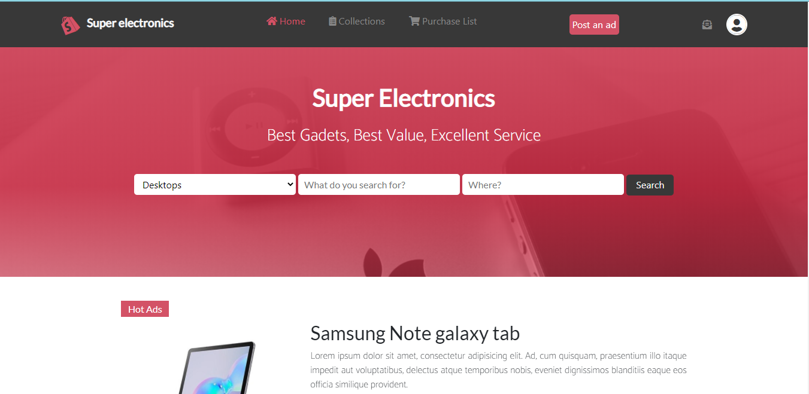
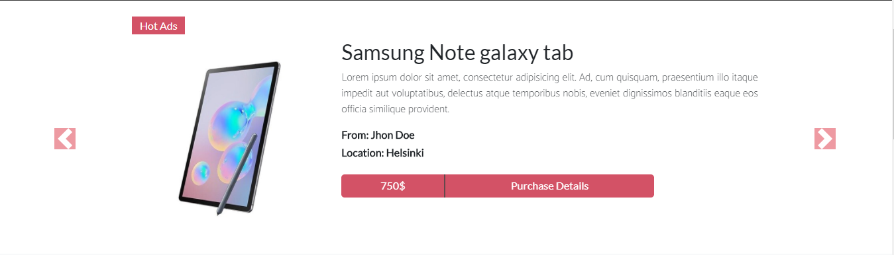
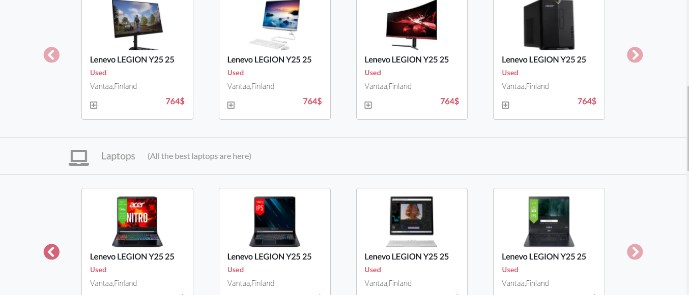
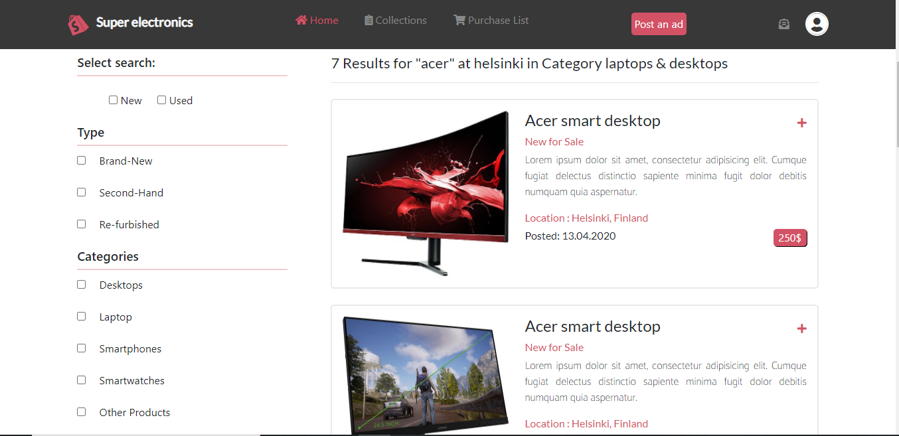

# Online-electronic-shop-capstone

This project was created to follow the design style of ZATTIX by Mohammed Awad and customize the design content in order to demonstrate HTML/CSS knowledge. The main aim of this project was to create a electronics online store by using the given design pattern.

</h1>Additional description about the project and its features.</h1>

<h2>Built With</h2>

- Html

- CSS

- Bootstrap

- A little bit Jquery

- Atom editor, Visual code

<h2>Live demo:</h2>

[Live demo](https://super-electronics.netlify.app)

<h2>Getting Started</h2>
To get a local copy up and running follow these simple example steps.

- Clone the  git repository.
- Or download the project folder.
- Open the folder in atom or visual code editor.
- Modify and check result in browser.

Prerequisites
Text editor,Github profile and Git.

<h2>Authors</h2>

👤 Avijit Karmaker

- Github:https://github.com/ajkacca457

- Twitter:https://twiter.com/ajkacca

- Linkedin: https://www.linkedin.com/in/avijit-karmaker-8738a54a/

<h2>🤝Contributing</h2>

Contributions, issues and feature requests are welcome!

Feel free to check the issues page.

Show your support
Give a ⭐️ if you like this project!

📝 <h2>License</h2>
This project is a solo project of Microverse student. All rights are reserved for Avijit and Microverse.
